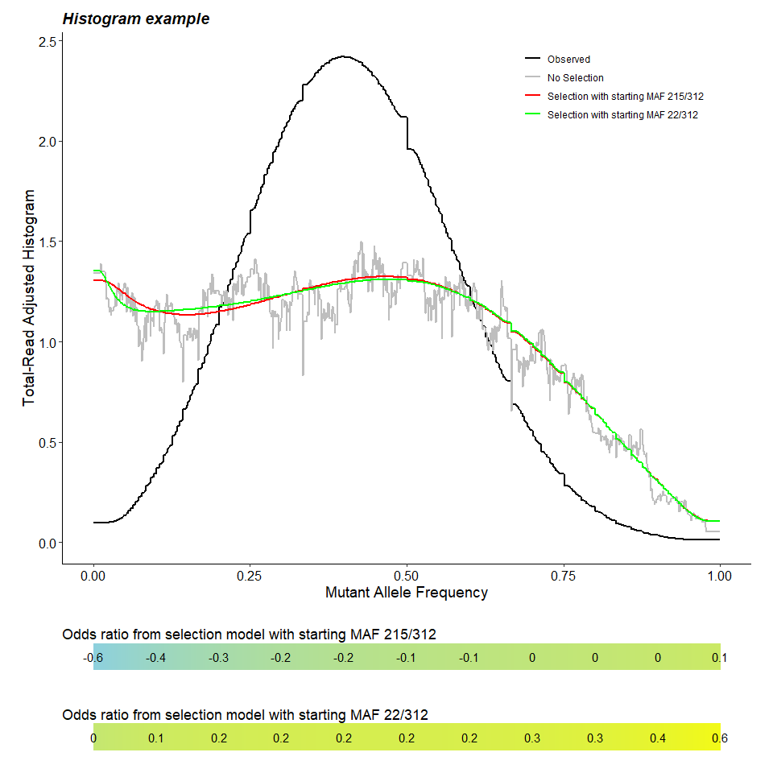

<!-- README.md is generated from README.Rmd. Please edit that file -->

# Mitovolve

<!-- badges: start -->
<!-- badges: end -->

*Mitovolve* is developed to infer the evolutionary history of somatic
mitochondrial DNA (mtDNA) mutations of singe-cell genomic sequencing
data. The method models the evolutionary changes in the prevalence of a
mtDNA mutation over successive generation of cells. For each cell, we
assume that the mutant mtDNA duplications inherits into daughter cell
following a hypergeometric distribution. Then for a given number of
generations, the number of mutant mtDNA is a convolution of
hypergeometrics. In the observed data with multiple cells, a certain
number of mtDNA reads are obtained for each cell. For each number of
mtDNA reads observed per cell, the number of mutant mtDNA reads is
obtained by hypergeometric sampling. In this way, we obtain a model
distribution of the mutant allele fraction (MAF) observed in our data.

For the model with selective pressure, *Mitovolve* uses noncentral
hypergeometric distribution with the log odds ratio of selecting a
mutant mtDNA as a cubic polynomial function
$\theta(m) = \beta_{0}+\beta_{1}m+\beta_{2}m^{2}+\beta_{3}m^{3}$, where
m is the mutant allele fraction. To model the process without
evolutionary pressure, Mitovolve uses a central hypergeometric
distribution obtained by setting
$\beta_{0}$=$\beta_{1}$=$\beta_{2}$=$\beta_{3}$=0 in the above equation
so that there is no preference for a mutant mtDNA over a wildtype mtDNA
(the log odds ratio $\theta(m) = 0$). Positive values for $\theta(m)$
indicate a selective preference for the mutant mtDNAs; negative values
for $\theta(m)$ indicate a selective preference for the wildtype mtDNAs.

*Mitovolve* uses a likelihood framework to evaluate the fit of a series
of probabilistic models. The likelihood ratio test is used to evaluate
the hypothesis that there is no selective pressure by comparing
selective model with the best selection-free model. Finally, all best
fitted model and observed data can be visualized by histogram plot of
MAF.

## Installation

You can install the *Mitovolve* from github:

``` r
#install.packages("devtools")
devtools::install_github("yonghui-ni/Mitovolve")
#> Using GitHub PAT from the git credential store.
#> Downloading GitHub repo yonghui-ni/Mitovolve@HEAD
#> 
#> ── R CMD build ─────────────────────────────────────────────────────────────────
#>          checking for file 'C:\Users\yni54\AppData\Local\Temp\RtmpoH8Xvf\remotes66247fa41749\yonghui-ni-Mitovolve-6b82dfb/DESCRIPTION' ...  ✔  checking for file 'C:\Users\yni54\AppData\Local\Temp\RtmpoH8Xvf\remotes66247fa41749\yonghui-ni-Mitovolve-6b82dfb/DESCRIPTION' (411ms)
#>       ─  preparing 'Mitovolve':
#>    checking DESCRIPTION meta-information ...  ✔  checking DESCRIPTION meta-information
#>       ─  checking for LF line-endings in source and make files and shell scripts
#>   ─  checking for empty or unneeded directories
#>      NB: this package now depends on R (>=        NB: this package now depends on R (>= 3.5.0)
#>        WARNING: Added dependency on R >= 3.5.0 because serialized objects in
#>      serialize/load version 3 cannot be read in older versions of R.
#>      File(s) containing such objects:
#>        'Mitovolve/data/reads.RData' 'Mitovolve/data/res.tbl.RData'
#> ─  building 'Mitovolve_0.1.0.tar.gz'
#>      
#> 
#> Installing package into 'C:/Users/yni54/AppData/Local/R/win-library/4.3'
#> (as 'lib' is unspecified)
```

## Load package

``` r
library(Mitovolve)
```

## Example

Following is the example of the package usage. We have the single-cell
RNA-seq data obtained from a pediatric subject’s leukemic cells
harboring a single tumor enriched mtDNA mutation at the time of
diagnosis. 1,888 leukemia cells are used for analysis, each cell with at
least 1 mutant read. First, we can use full.mle() in the package to do
model estimation by inputing observed reads data (we have example reads
data called “reads” in the package), the total copy number from 0 to
312, the generation from 1 to 45. Total 14398 model without selection
are estimated. Since the selective model estimation of 14398 models
needs long computation time, we specify the MAF and generation to
estimate less selection models in full.mle() step by setting
selection.mut.start = round(seq(0,312,312\*0.01) and selection.reps =
seq(33,43,1). By this step, we have result output from full.mle() and
save as an example called ‘res.tbl’ in our package.

``` r
head(reads)
#>      mut.read wt.read
#> [1,]        6      13
#> [2,]       75      35
#> [3,]        6      67
#> [4,]       85       5
#> [5,]        0       9
#> [6,]        4       2
head(res.tbl)
#>       mutant.start nmito.start generation null.nlogL alt.nlogL     beta3
#> 14213          127         312         45   6350.531  5602.575 0.8224367
#> 14214          128         312         45   6350.541  5602.576 0.8203761
#> 14212          126         312         45   6351.211  5602.573 0.8244970
#> 14215          129         312         45   6351.238  5602.577 0.8183210
#> 14211          125         312         45   6352.584  5602.572 0.8265593
#> 14216          130         312         45   6352.619  5602.578 0.8162666
#>           beta2    beta1      beta0
#> 14213 -1.460279 1.030039 -0.2307204
#> 14214 -1.459949 1.032182 -0.2326098
#> 14212 -1.460602 1.027888 -0.2288282
#> 14215 -1.459618 1.034319 -0.2344967
#> 14211 -1.460920 1.025730 -0.2269332
#> 14216 -1.459282 1.036449 -0.2363812
```

In the res.tbl, we have negative log-likelihood value of selection-free
model and selection model and coefficient estimates of selection model
cubic function. We can see the best selection-free model:

``` r
res.tbl[which(res.tbl$null.nlogL==min(res.tbl$null.nlogL)),]
#>       mutant.start nmito.start generation null.nlogL alt.nlogL     beta3
#> 14213          127         312         45   6350.531  5602.575 0.8224367
#>           beta2    beta1      beta0
#> 14213 -1.460279 1.030039 -0.2307204
```

Then, we use likelihood ratio test to compares the fit of selection and
no selection models (the best no selection model). Here we specify the
generations we are interested in

``` r
res = P_value(res.tbl = res.tbl,
              baseline.model =  "best-non-selection",
              alt.model = "selection")
head(res$res.table.pval)
#>       mutant.start nmito.start generation null.nlogL alt.nlogL     beta3
#> 14213          127         312         45   6350.531  5602.575 0.8224367
#> 14214          128         312         45   6350.541  5602.576 0.8203761
#> 14212          126         312         45   6351.211  5602.573 0.8244970
#> 14215          129         312         45   6351.238  5602.577 0.8183210
#> 14211          125         312         45   6352.584  5602.572 0.8265593
#> 14216          130         312         45   6352.619  5602.578 0.8162666
#>           beta2    beta1      beta0 df          pval
#> 14213 -1.460279 1.030039 -0.2307204  4 1.086944e-322
#> 14214 -1.459949 1.032182 -0.2326098  5 2.262821e-321
#> 14212 -1.460602 1.027888 -0.2288282  5 2.257880e-321
#> 14215 -1.459618 1.034319 -0.2344967  5 2.267761e-321
#> 14211 -1.460920 1.025730 -0.2269332  5 2.257880e-321
#> 14216 -1.459282 1.036449 -0.2363812  5 2.272702e-321
all(res$res.table.pval$pval<0.05)
#> [1] TRUE
```

Since we have 1089 selection models LR test p-values less than 0.05, we
could use clustering method on $\beta$ coefficients of these models to
get the best selection model. We can see that from 10 clusters, the best
selection models are both from low-starting and high-starting MAF. The
third row of res.tbl.best is the best model without selection.

``` r
res.tbl.best = get.best.model(res.tbl = res$res.table.pval,K = 10,show.best = TRUE)
#> [1] "The best models are from modeling with low-starting MAF and high-starting MAF"
res.tbl.best
#>   nmito.start mutant.start generation       beta0    beta1     beta2     beta3
#> 1         312          268         43 -0.53852036 1.273206 -1.156520 0.3470694
#> 2         312           22         33  0.02113842 1.082474 -2.164404 1.6110367
#> 3         312          127         45  0.00000000 0.000000  0.000000 0.0000000
#>      nlogL
#> 1 5603.155
#> 2 5602.132
#> 3 6350.531
```

## Model Visulization

Plot of mtDNA mutation probability distribution over generations

``` r
res.tbl.best$clr = c("red","green","grey")        
plt.mtDNA.gens(res.tbl.best = res.tbl.best, ngen.show=5)
```


Histogram of mtDNA for the mutant allele fraction in the mtDNA mutation
model and beta-smoothed hisogram

``` r
plt.hist(read.data = reads,
           res.tbl.best = res.tbl.best,
           nbin = 1000,
           clr.scheme = "rainbow",
           show.logOR = TRUE,
           plot.title = "Histogram example")
```



``` r
plt.hist.smooth(read.data = reads,
                  res.tbl.best = res.tbl.best,
                  plot.title = "Beta-smoothed historam example")
```


Plot the modeling of mtDNA mutation distribution respect to CDF or log
odds ratio

``` r
plt.mtDNA.model(res.tbl.best = res.tbl.best,
                read.data = reads,
                plot.type = "CDF")
```


